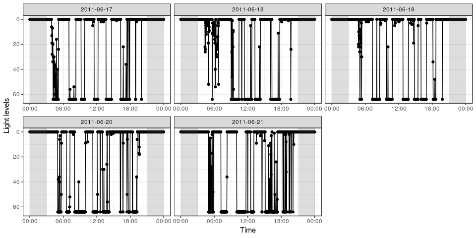
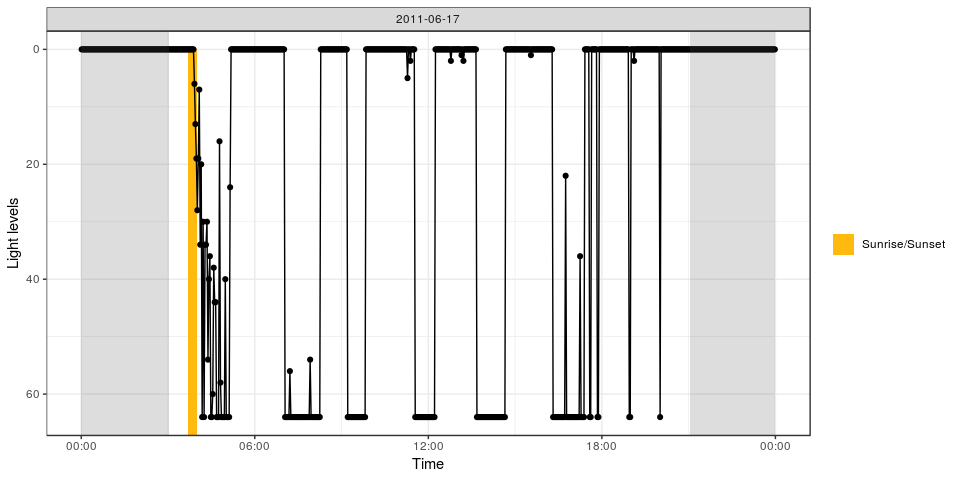
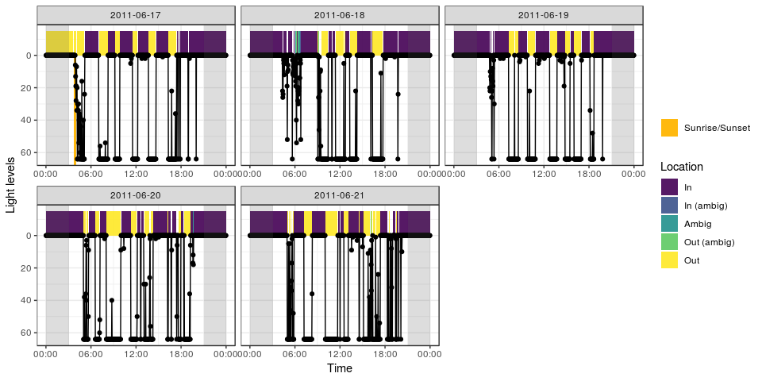

cavityuse
=========

*Detecting Cavity Use From Geolocator Data*

[](https://travis-ci.org/steffilazerte/cavityuse) [](https://ci.appveyor.com/project/steffilazerte/cavityuse/branch/master) [](https://codecov.io/gh/steffilazerte/cavityuse)

`cavityuse` is an R package for calculating patterns of cavity use from geolocator light data. Patterns of light and dark are used to identify daytime usage, while patterns of sunrise/sunset are used to identify nighttime usage.

> While `cavityuse` is ready to be experimented with, it's still in early development. Please give me a hand by letting me know of any problems you have (missing functionality, difficult to use, bugs, etc.)

Installing `cavityuse`
----------------------

You can use the `devtools` package to install `cavityuse` directly from GitHub

``` r
devtools::install_github("steffilazerte/cavityuse")
```

Getting started
---------------

Load the package

``` r
library(cavityuse)
```

    ## cavityuse v0.1.0
    ## Please note that 'cavityuse' is still in early development
    ## Help by submitting bugs/feature requests: http://github.com/steffilazerte/cavityuse/issues

We'll get started with the built in example file `flicker`

Let's take a look at the patterns in the raw data:

``` r
cavity_plot(flicker)
```



Look for any sunrise/sunset events in your geolocator data

``` r
s <- sun_detect(flicker)
s
```

    ## # A tibble: 1 x 6
    ##   date       time                dir     n_range     n   dur
    ##   <date>     <dttm>              <chr>     <dbl> <int> <dbl>
    ## 1 2011-06-17 2011-06-17 03:40:50 sunrise      28    10    20

Let's see what these look like

``` r
cavity_plot(data = flicker, sun = s, start = "2011-06-17", days = 1)
```



Using these detected times, assign the rest of the light data to bouts of cavity use:

``` r
e <- cavity_detect(flicker, sun = s)
e
```

    ## # A tibble: 213 x 9
    ##    date       start               end                 length_hrs location
    ##    <date>     <dttm>              <dttm>                   <dbl> <chr>   
    ##  1 2011-06-17 2011-06-17 00:00:50 2011-06-17 03:38:50      3.63  out     
    ##  2 2011-06-17 2011-06-17 03:40:50 2011-06-17 04:04:50      0.4   out     
    ##  3 2011-06-17 2011-06-17 04:06:50 2011-06-17 04:06:50      0     out_amb…
    ##  4 2011-06-17 2011-06-17 04:08:50 2011-06-17 04:08:50      0     ambig   
    ##  5 2011-06-17 2011-06-17 04:10:50 2011-06-17 05:06:50      0.933 out     
    ##  6 2011-06-17 2011-06-17 05:08:50 2011-06-17 05:08:50      0     ambig   
    ##  7 2011-06-17 2011-06-17 05:10:50 2011-06-17 07:00:50      1.83  in      
    ##  8 2011-06-17 2011-06-17 07:02:50 2011-06-17 08:14:50      1.2   out     
    ##  9 2011-06-17 2011-06-17 08:16:50 2011-06-17 09:10:50      0.9   in      
    ## 10 2011-06-17 2011-06-17 09:12:50 2011-06-17 09:48:50      0.6   out     
    ## # ... with 203 more rows, and 4 more variables: thresh_dark <dbl>,
    ## #   thresh_light <dbl>, ambig_dark <dbl>, ambig_light <dbl>

Let's see how these assignments match the patterns we see

``` r
cavity_plot(data = flicker, cavity = e, sun = s)
```



With your own data
------------------

You data must be in a data frame with the columns called `time` and `light`.

-   `time` must be in a `date/time` format
-   `light` must be a number, representing light levels in lux (low = dark, high = light)

For example:

    ## # A tibble: 3,600 x 2
    ##    time                light
    ##    <dttm>              <dbl>
    ##  1 2011-06-17 00:00:50     0
    ##  2 2011-06-17 00:02:50     0
    ##  3 2011-06-17 00:04:50     0
    ##  4 2011-06-17 00:06:50     0
    ##  5 2011-06-17 00:08:50     0
    ##  6 2011-06-17 00:10:50     0
    ##  7 2011-06-17 00:12:50     0
    ##  8 2011-06-17 00:14:50     0
    ##  9 2011-06-17 00:16:50     0
    ## 10 2011-06-17 00:18:50     0
    ## # ... with 3,590 more rows

Consider using the [`lubridate`](https://lubridate.tidyverse.org/) package to format your times

### Timezones

Although most geolocator data is in the UTC timezone, to more efficiently detect sunrise/sunset times, your data should be in the timezone of your location (non-daylight savings).

You can use the `tz_offset` function to determine what timezone this would be, and the `with_tz` function from the lubridate package to assign this timezone to your data:

``` r
tz_offset("America/Vancouver")
```

    ## [1] "Etc/GMT+8"

``` r
library(lubridate)
data$time <- with_tz(data$time, "Etc/GMT+8")
```

### Coordinates

`cavityuse` functions require coordinates in order to more efficiently detect sunrise/sunset times, but also to estimate sunrise/sunset when they are not detected in the data.

You can supply coordinates in one of two ways.

-   You can have `lon` and `lat` columns, indicating the decimal coordinates for your location either in your data

<!-- -->

    ## # A tibble: 3,600 x 4
    ##    time                light   lon   lat
    ##    <dttm>              <dbl> <dbl> <dbl>
    ##  1 2011-06-17 00:00:50     0 -120.  50.7
    ##  2 2011-06-17 00:02:50     0 -120.  50.7
    ##  3 2011-06-17 00:04:50     0 -120.  50.7
    ##  4 2011-06-17 00:06:50     0 -120.  50.7
    ##  5 2011-06-17 00:08:50     0 -120.  50.7
    ##  6 2011-06-17 00:10:50     0 -120.  50.7
    ##  7 2011-06-17 00:12:50     0 -120.  50.7
    ##  8 2011-06-17 00:14:50     0 -120.  50.7
    ##  9 2011-06-17 00:16:50     0 -120.  50.7
    ## 10 2011-06-17 00:18:50     0 -120.  50.7
    ## # ... with 3,590 more rows

-   You can have a separte variable that you supply to each function (order matters, and must be `lon`, `lat`):

``` r
sun_times(data, loc = c(-120.3408, 50.67611))
```

Limitations
-----------

Right now, `cavityuse` is limited to the follow scenarios:

-   **No big changes in location (i.e. No migration)** Changes in location can interfere with how `cavityuse` assigns activity based on sunrise/sunset times which are inferred from lon/lat (this may change in the future)
-   **No extreme latitudes** Because of the way `cavityuse` detects sunrise and sunset, extremely latitudes may result in unpredicatable behaviour (this should hopefully be fixed in the future)
-   **Animals which use cavities at night, must normally enter their cavity *before* it gets dark and exit *after* it gets light** With out the ability to detect sunrise/sunset it is impossible to determine cavityuse at night

Please note that this project is released with a [Contributor Code of Conduct](CONDUCT.md). By participating in this project you agree to abide by its terms.
