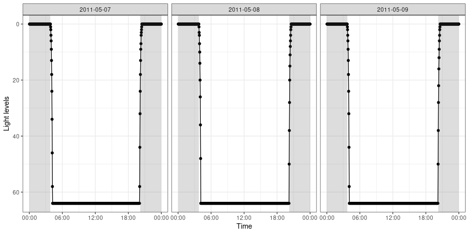
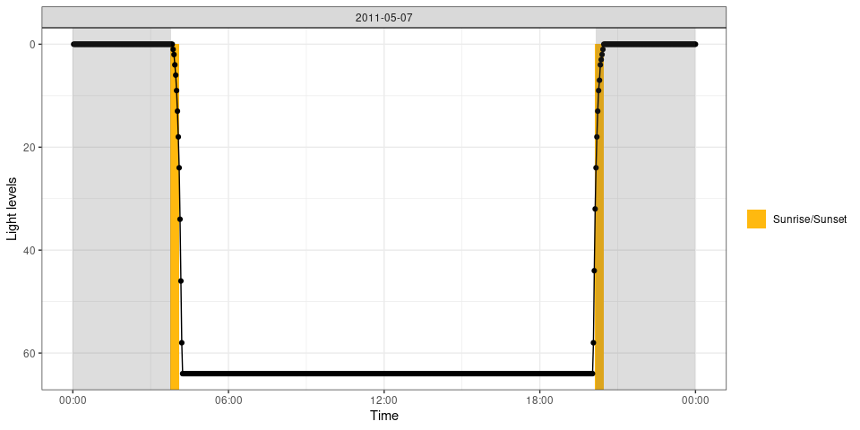
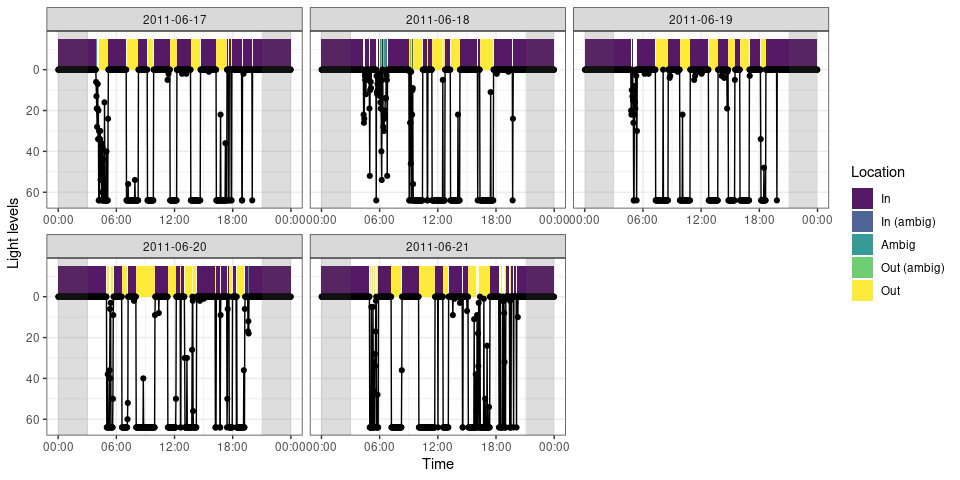

<!-- badges: start -->

[](https://github.com/steffilazerte/cavityuse/actions)
[](https://codecov.io/gh/steffilazerte/cavityuse)
<!-- badges: end -->

# cavityuse

*Detecting Cavity Use From Geolocator Data*

`cavityuse` is an R package for calculating patterns of cavity use from
geolocator light data. Patterns of light and dark are used to identify
daytime usage, while patterns of sunrise/sunset are used to identify
nighttime usage.

> While `cavityuse` is ready to be experimented with, it’s still in
> early development and should be considered **experimental**. Please
> give me a hand by letting me know of any problems you have (missing
> functionality, difficult to use, bugs, etc.)

## Installing `cavityuse`

You can install `cavityuse` directly from my R-Universe:

``` r
install.packages("cavityuse", 
                 repos = c("https://steffilazerte.r-universe.dev", 
                           "https://cloud.r-project.org"))
```

## Getting started

Load the package

``` r
library(cavityuse)
```

    ## cavityuse v0.5.0
    ## Please note that 'cavityuse' is still in early development
    ## Help by submitting bugs/feature requests: http://github.com/steffilazerte/cavityuse/issues

We’ll get started with the built in example file `calib` which clearly
shows sunrise/sunset events

Let’s take a look at the patterns in the raw data:

``` r
cavity_plot(calib)
```



Look for any sunrise/sunset events in your geolocator data

``` r
s <- sun_detect(calib)
s
```

    ## # A tibble: 6 × 7
    ##   date       time                dir     n_range     n   dur offset_applied
    ##   <date>     <dttm>              <chr>     <dbl> <int> <int>          <dbl>
    ## 1 2011-05-07 2011-05-07 03:45:57 sunrise      24    10    20             -8
    ## 2 2011-05-07 2011-05-07 20:07:57 sunset       32    10    20             -8
    ## 3 2011-05-08 2011-05-08 03:47:57 sunrise      63    10    20             -8
    ## 4 2011-05-08 2011-05-08 20:09:57 sunset       62    10    20             -8
    ## 5 2011-05-09 2011-05-09 03:39:56 sunrise      32    10    20             -8
    ## 6 2011-05-09 2011-05-09 20:11:56 sunset       62    10    20             -8

Let’s see what these look like

``` r
cavity_plot(data = calib, sun = s, days = 1)
```



Now let’s move on to the `flicker` data set:

``` r
cavity_plot(flicker)
```


``` r
s <- sun_detect(flicker) # Nothing detected
e <- cavity_detect(flicker, sun = s)
e
```

    ## # A tibble: 217 × 12
    ##    date       start               end                 length_hrs location 
    ##    <date>     <dttm>              <dttm>                   <dbl> <chr>    
    ##  1 2011-06-17 2011-06-17 00:00:50 2011-06-17 03:52:50     3.87   in       
    ##  2 2011-06-17 2011-06-17 03:54:50 2011-06-17 03:54:50     0      in_ambig 
    ##  3 2011-06-17 2011-06-17 03:56:50 2011-06-17 03:58:50     0.0333 ambig    
    ##  4 2011-06-17 2011-06-17 04:00:50 2011-06-17 04:00:50     0      out_ambig
    ##  5 2011-06-17 2011-06-17 04:02:50 2011-06-17 04:02:50     0      ambig    
    ##  6 2011-06-17 2011-06-17 04:04:50 2011-06-17 04:04:50     0      in_ambig 
    ##  7 2011-06-17 2011-06-17 04:06:50 2011-06-17 04:06:50     0      out_ambig
    ##  8 2011-06-17 2011-06-17 04:08:50 2011-06-17 04:08:50     0      ambig    
    ##  9 2011-06-17 2011-06-17 04:10:50 2011-06-17 05:06:50     0.933  out      
    ## 10 2011-06-17 2011-06-17 05:08:50 2011-06-17 05:08:50     0      ambig    
    ## # … with 207 more rows, and 7 more variables: offset_applied <dbl>, lon <dbl>,
    ## #   lat <dbl>, thresh_dark <dbl>, thresh_light <dbl>, ambig_dark <dbl>,
    ## #   ambig_light <dbl>

Let’s see how these assignments match the patterns we see

``` r
cavity_plot(data = flicker, cavity = e)
```



## With your own data

You data must be in a data frame with the columns called `time` and
`light`.

-   `time` must be in a `date/time` format
-   `light` must be a number, representing light levels in lux (low =
    dark, high = light)

For example:

    ## # A tibble: 3,600 × 2
    ##    time                light
    ##    <dttm>              <dbl>
    ##  1 2011-06-17 08:00:50     0
    ##  2 2011-06-17 08:02:50     0
    ##  3 2011-06-17 08:04:50     0
    ##  4 2011-06-17 08:06:50     0
    ##  5 2011-06-17 08:08:50     0
    ##  6 2011-06-17 08:10:50     0
    ##  7 2011-06-17 08:12:50     0
    ##  8 2011-06-17 08:14:50     0
    ##  9 2011-06-17 08:16:50     0
    ## 10 2011-06-17 08:18:50     0
    ## # … with 3,590 more rows

Consider using the [`lubridate`](https://lubridate.tidyverse.org/)
package to format your times

### Timezones

Most geolocator data is in the UTC timezone, and although previous
versions of cavityuse recommended converting your data to your the
timezone of your location (non-daylight savings), I now recommend
keeping it in UTC. cavityuse will apply a timezone offset to your data
according to the location.

This means that the time output by cavityuse will be in UTC according to
R, however it will actually have had an offset applied (noted in the new
column `tz_offset`). This just makes things simpler.

### Coordinates

`cavityuse` functions require coordinates in order to more efficiently
detect sunrise/sunset times, but also to estimate sunrise/sunset when
they are not detected in the data.

You can supply coordinates in one of two ways.

-   You can have `lon` and `lat` columns, indicating the decimal
    coordinates for your location either in your data

<!-- -->

    ## # A tibble: 3,600 × 4
    ##    time                light   lon   lat
    ##    <dttm>              <dbl> <dbl> <dbl>
    ##  1 2011-06-17 08:00:50     0 -120.  50.7
    ##  2 2011-06-17 08:02:50     0 -120.  50.7
    ##  3 2011-06-17 08:04:50     0 -120.  50.7
    ##  4 2011-06-17 08:06:50     0 -120.  50.7
    ##  5 2011-06-17 08:08:50     0 -120.  50.7
    ##  6 2011-06-17 08:10:50     0 -120.  50.7
    ##  7 2011-06-17 08:12:50     0 -120.  50.7
    ##  8 2011-06-17 08:14:50     0 -120.  50.7
    ##  9 2011-06-17 08:16:50     0 -120.  50.7
    ## 10 2011-06-17 08:18:50     0 -120.  50.7
    ## # … with 3,590 more rows

-   You can have a separate variable that you supply to each function
    (order matters, and must be `lon`, `lat`):

``` r
sun_times(data, loc = c(-120.3408, 50.67611))
```

## Limitations

Right now, `cavityuse` is limited to the follow scenarios:

-   **No big changes in location (i.e. No migration)** Changes in
    location can interfere with how `cavityuse` assigns activity based
    on sunrise/sunset times which are inferred from lon/lat (this may
    change in the future). Minor migratory changes can be accommodated,
    and larger ones can be somewhat handled by splitting the data by
    location (different lat/lons) and applying `cavity_detect()` to each
    set of locations. But this isn’t perfect.
-   **No extreme latitudes** Because of the way `cavityuse` detects
    sunrise and sunset, extremely latitudes may result in unpredicatable
    behaviour (this should hopefully be fixed in the future)
-   **Animals which use cavities at night, must normally enter their
    cavity *before* it gets dark and exit *after* it gets light** With
    out the ability to detect sunrise/sunset it is impossible to
    determine cavityuse at night

Please note that this project is released with a [Contributor Code of
Conduct](CONDUCT.md). By participating in this project you agree to
abide by its terms.
